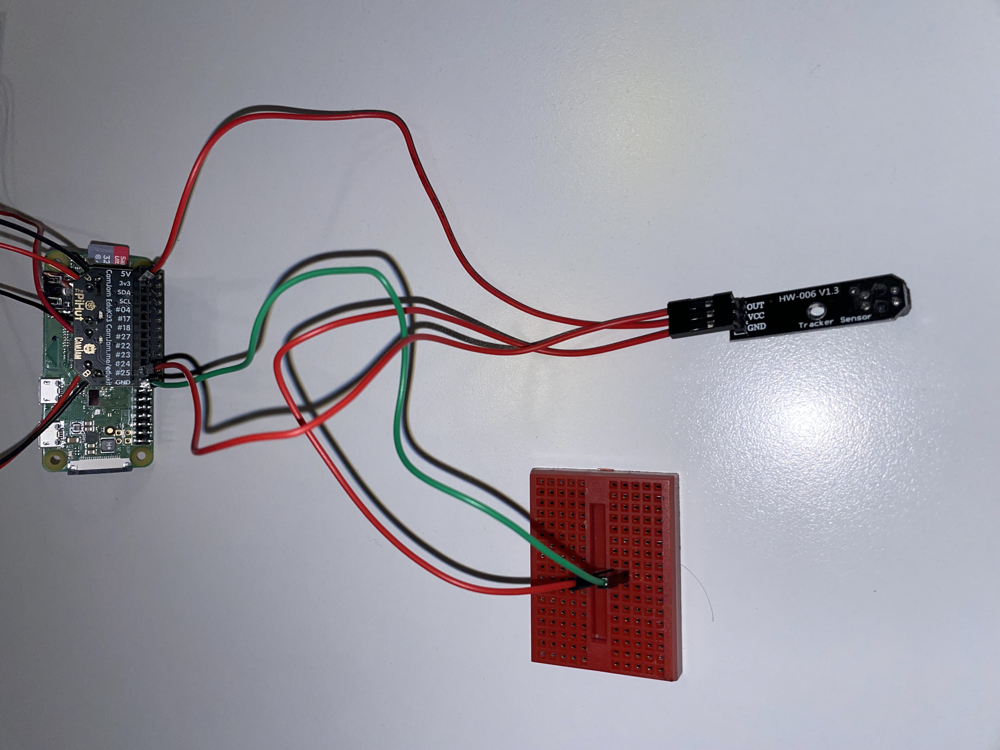

# DIGI KICK-OFF 2023

# Kit Check
Before getting started, do a quick kit check:
- 1 Raspberry Pi Zero
- 1 SD Card
- 1 power bank with micro-USB cable
- 2 wheels
- 2 motors with attached red + black cables
- 1 power pack with attached red + black cables
- 4 AA batteries
- 1 CamJam motor controller board
- 1 light sensor
- 1 small breadboard
- 3 female-to-male jumper cables
- 4 male-to-male jumper cable
- 2 sets of 2 resistors
- 2 3M double-sided adhesive pads

# Turning on the Pi
Plug in your Raspberry Pi Zero to your power bank
- It could take quite a few minutes for your device to startup for the first time, so find something to keep your busy
- Once the Raspberry Pi is ready, the green light should be constant
- You can connect to your device with `ssh -v team-n@team-n.local` (where `n` is your team number)
- Your password will be `password-n`

If you can't connect to this address, you will need to find the IP of the `team-n` device on the network. First, run the following to find the IP of your own computer: 
```shell
hostname -I
```

For instance, if your IP is `192.168.200.42`, you can run the below to scan the network to find your Pi:
```shell
nmap -sn 192.168.200.0/24 | grep -e team-n
```

# Get the Docs
Visit `camjam.me/edukit` (this is CamJam Edukit 3 Robotics) and clone the worksheets to your local machine to use as a reference:
```shell
git clone https://github.com/CamJam-EduKit/EduKit3
```

Also clone the kick-off repository to your local machine for reference implementations of code:
```shell
git clone git@github.com:edfincham/digi-kickoff-2023.git
```

# Setting Up the Robot
First thing is wiring up the motor controller board to the wheels and battery pack:
- Ensure the battery pack is empty and switched off
- The yellow end of each motor is the front; the wires are on the inner side of the motor
- The black and red wires in the motors are not guaranteed to be correct. If a motor turns in the opposite directions when going forward, switch the wires on that motor

**IMPORTANT**:
- The orientation of the battery box wires is important and can damage the controller board if you get it wrong.
- The red wire should enter the terminal marked with `+` or `VCC`
- The black wire should enter the terminal marked with`-` or `GND`


Once the wheels and battery pack are connected to the motor controller, connect the board to the Raspberry Pi Zero's GPIO board:


# Running the Motors
The Raspbian OS already has Python3 installed along with a Python package which enables control of the motors. To see this in action, copy the code below, or run the `motors.py` script in the code examples directory:
```python
import time
from gpiozero import CamJamKitRobot

robot = CamJamKitRobot()

robot.forward()
time.sleep(2)

robot.backward()
time.sleep(2)

robot.stop()
```

# Turning and Reversing
Turning is simple with the `CamJamKitRobot` interface. Copy the code below, or run the `rotate.py` script in the examples directory:
```python
import time
from gpiozero import CamJamKitRobot

robot = CamJamKitRobot()

robot.left()
time.sleep(2)

robot.right()
time.sleep(2)

robot.stop()
```

# Setting Up the Light Sensor
The light sensor (or "line following sensor") is composed of two parts: a light emitter and a light detector. The emitter sends out a light of known frequency and the detector measures how much comes back. If the surface is black, little light will be reflected. If the surface is white, more light will be reflected. This property can be used to follow a line.

To set up the light sensor, you will need:
- 1 sensor
- 1 breadboard
- 3 female-to-male jumper cables
- 1 male-to-male jumper cable

The light sensor has 3 pins:
- OUT
- VCC
- GND

The GND pin should be connected by a female-to-male jumper cable to the breadboard. Place an adjacent male-to-male jumper cable (adjacent along the shorter dimension) in the breadboard and connect the other end to the GND in the motor controller board.


The VCC (or voltage) line should be connected via a single female-to-male jumper cable to the 3v3 on the motor controller board.


Connect the OUT pin to the GPIO pin #25 on the motor controller board using a female-to-male jumper cable.



With the light sensor connected, we can run the following script to test if it is working (or `light.py` in the code samples):
```python
import time
from gpiozero import LineSensor

# Define GPIO pin
pinLineFollower = 25

sensor = LineSensor(pinLineFollower)


def lineseen():
    print("Line seen")


def linenotseen():
    print("No line seen")


sensor.when_line = lineseen

sensor.when_no_line = linenotseen

try:
    while True:
        time.sleep(10)
except KeyboardInterrupt:
    exit()
```

# Setting Up the Distance Sensor
The ultrasonic sensor module can be used to detect distance from the sensor to a surface. The module is composed of a speaker (or transmit, marked T) and a receiver (marked R). When a voltage is applied to the trig pin, the transmit emits a high pitched sound for 10 microseconds. When the sound is heard by the receiver, the echo pin emits a voltage. The latency is then used to calculate distance between the sensor and an object in front of it.

The sensor requires 5 volts on the trig pin, but also emits 5 volts on the echo pin. This is problematic as the GPIO input pins should only receive 3.3 volts. To work around this, we use a "voltage divider" to split the output voltage between the GPIO input pin and the GND pin.

What you will need:
- 1 sensor module
- 1 330Ω  resistor (see below)
- 1 470Ω resistor (see below)
- 3 male-to-male jumper cables

## Which resistor is which?
The kit should contain two sets of resistors. There are two 330Ω resistors and two 470Ω
resistors. Only one of each is required; extras are supplied as spares. You can identify the resistors
by the colour bands along the body. The colour coding will depend on how many bands are on the
resistors supplied:
- If there are four colour bands:
    - The 330Ω resistor will be Orange, Orange, Brown, and then Gold.
    - The 470Ω resistor will be Yellow, Violet, Brown, and then Gold.
- If there are five colour bands:
    - The 330Ω resistor will be Orange, Orange, Black, Black, Brown.
    - The 470Ω resistor will be Yellow, Violet, Black, Black, Brown.

If your kit contains 3 sets of resistors, the one marked Yellow, Violet, Black, Brown, Brown can be ignored. 

It does not matter which way round you connect the resistors. Current flows in both ways through them.

## Building the Sensor Circuit
Below is an image of what the connections. At the top is the light sensor from previously (although the number of pins is wrong). Instead, focus on the breadboard and the motor control board at the bottom.


These are the steps:
1. Push the sensor into the breadboard with the pin marked GND in the same line as the two existing jumper cables which connect to the GND on the motor controller board


2. Bend the legs of the resistors and place them in the breadboard

3. The 330Ω resistor goes between the Echo pin of the sensor and an unused column of the breadboard

4. The 470Ω resistor goes between the same, previously unused, column and the ground (GND) column pin


5. Then connect the same, previously unused, column to socket 18 on the motor controller board


6. Since the sensor requires 5V to run, connect the VCC column to the motor controller board's 5V socket


7. Connect the trig column to the motor controller board's socket 17


Once everything is connected, run the following code to get distance measurements (or `distance.py` in the example code folder):
```python
import time
from gpiozero import DistanceSensor

# Define GPIO pins
pintrigger = 17
pinecho = 18

sensor = DistanceSensor(echo=pinecho, trigger=pintrigger)

try:
    while True:
        print("Distance: %.3f cm" % (sensor.distance * 100))
        time.sleep(0.5)
except KeyboardInterrupt:
    exit()
```

# Speed and Calibration
You may notice that while small, the motors are actually pretty quick. Before trying to control the robot, you need to be able to slow it down somewhat. To do this, we can make use of what's called Pulse-Width Modulation (PWM). This essentially involves turning the GPIO pins on and off at some frequency. Note that this happens so quickly that you won't even notice the motors start and stop, but it does mean that we can control the speed of the motors.

There are two parameters that control PWM: frequency and duty cycle.

## Frequency
Frequency (in Hertz) is the number of times per second that a pulse is generated.

## Duty Cycle
Duty cycle is the percentage of time between pulses that the signal is on.

## Examples
Let's say that we have a frequency of 50hz and a duty cycle of 50%.

This gives us a pulse 50 times per time (or every 0.02s). During each 0.02s time period, the GPIO socket will be on (at 3.3V) half the time, and off (at 0V) the other half. If we were to graph this, it would look like the below:


Alternatively, consider a frequency of 50Hz with a duty cycle of 75%.

This gives us the same 0.02s pulse interval, but in this case the GPIO socket would be on at 3.3V for 0.015s per pulse and off for 0.005s per pulse.


In spite of all this talk of frequencies and duty cycles, when it comes to the `CamJamKitRobot` interface, we can just set the speed using a scalar value between 0.0 and 1.0. To see this in action, copy the code below, or run the `speed.py` script in the code examples directory:
```python
import time
from gpiozero import CamJamKitRobot

robot = CamJamKitRobot()

# Set the relative speeds of the two motors, between 0.0 and 1.0
motorspeed = 0.3
motorforward = (motorspeed, motorspeed)
motorbackward = (-motorspeed, -motorspeed)
motorleft = (motorspeed, 0)
motorright = (0, motorspeed)

robot.value = motorforward
time.sleep(1)

robot.value = motorbackward
time.sleep(1)

robot.value = motorleft
time.sleep(1)

robot.value = motorright
time.sleep(1)

robot.stop()
```

You may notice, however, that your robot does not go in a straight line. This can be fixed quite easily, although it will need some calibration. In the previous `speed.py` script, we just set each motor to have the same speed multiplier. This doesn't have to be the case; we can instead pass two separate values in the `motorspeed` tuple - one for each motor. Check out the `calibration.py` script or copy the code below to get started:
```python
import time
from gpiozero import CamJamKitRobot

robot = CamJamKitRobot()

# Set the relative speeds of the two motors, between 0.0 and 1.0
leftmotorspeed = 0.4
rightmotorspeed = 0.6

motorforward = (leftmotorspeed, rightmotorspeed)
motorbackward = (-leftmotorspeed, -rightmotorspeed)
motorleft = (leftmotorspeed, 0)
motorright = (0, rightmotorspeed)

robot.value = motorforward
time.sleep(1)

robot.value = motorbackward
time.sleep(1)

robot.value = motorleft
time.sleep(1)

robot.value = motorright
time.sleep(1)

robot.stop()
```

# Remote Control
One way to control the robot is over a web-server. To do this, we're going to use Flask:
```shall
sudo apt-get install python3-flask
```

Sample code to run a web-app with simple motion controls can be found in the `examples/web-server` directory. The app is very simple and contains the following structure:
```shell
├── app.py
├── static
│   └── style.css
└── templates
    └── index.html
```

To start the webserver, run:
```shell
sudo python app.py
```

Now to access your webserver from different devices, you will need to find your Raspberry Pi's IP. To do so, run:
```shell
hostname -I
```

You should then be able to connect to your Raspberry Pi's web server by pasting the IP into your browser followed by port 5000.
